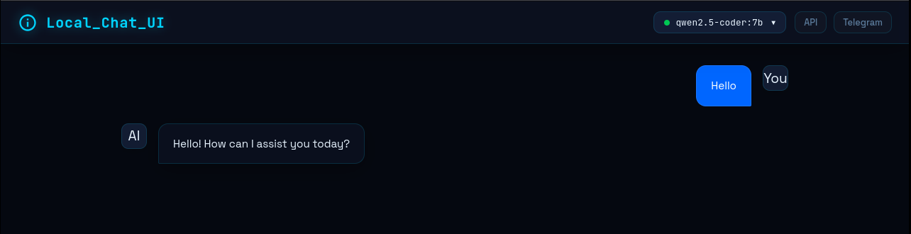
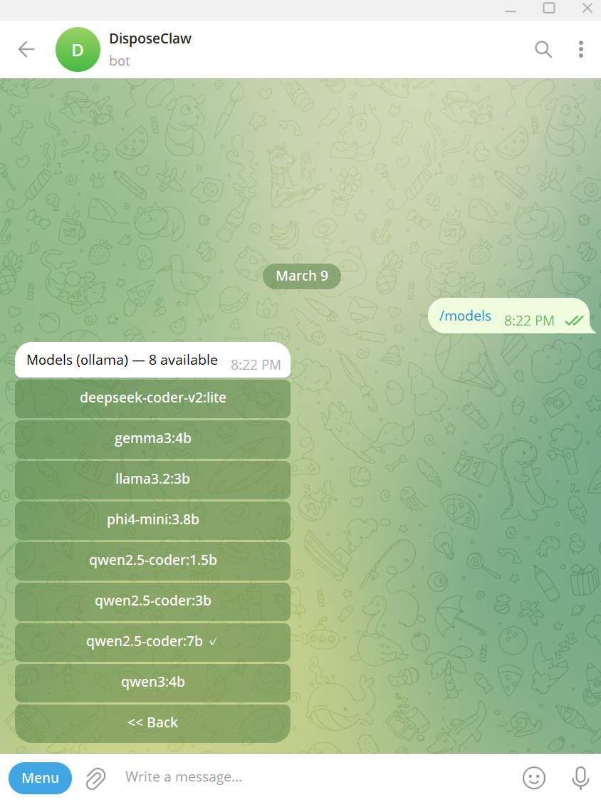

# DisposeClaw: A Claw that Won't Work Because Your VM is Too Weak

[**📖 Lesson Plan Here**](#)

**Learning Why and How this Impacts Your costs when using 3rd party APIs.**

## Overview
- **Easy `setup.sh` and `delete.sh` to start and delete the project**
  - *You are installing LLMs so you'll need 16GB RAM and a few spare CPU Cores. Be patient during the install. It takes a few minutes.*

## Features
- **Local LLM Running in Docker**: Complete control over your data with locally running models.
- **OpenClaw Agent Core**: Connects directly to Telegram. (It won't work well, but you'll learn how this works!)

## Quick Start

1. Clone this repository:
   ```bash
   git clone https://github.com/androidteacher/DisposeClaw-Local-LLM-OpenClaw-Tutorial.git
   cd DisposeClaw-Local-LLM-OpenClaw-Tutorial/App_Deploy
   ```
2. Run the interactive setup script:
   ```bash
   bash setup.sh
   ```

## Test the Raw LLM (Chat WebUI)



Before linking the agent, you should test the raw LLM to see its baseline speed.
1. Navigate to **http://localhost:8888**
2. Type "hello" and hit send.
3. You should find that this works smoothly and a response is returned in a few seconds. This demonstrates the speed and small token size of a *simple* prompt.

## Telegram Setup Walkthrough



If you haven't linked the agent to Telegram yet, the system provides a Config WebUI to guide you.
1. Navigate to **http://localhost:9999**
2. Follow the instructions on screen:
   - Create a Bot using `@BotFather` on Telegram.
   - Run the `./enter_api.sh` script on your deployment server and paste your Token.
   - Start a conversation with your bot on Telegram.
   - Click the open dashboard button to approve the pairing request on the OpenClaw Dashboard.
   - This will SPIKE YOUR VM CPU. (This is fine, but the reason behind it is one of the main points why this repository/lesson is here!)

## Port Reference
All services are bound to `127.0.0.1` (localhost only) to prevent unauthorized network access.

| Service | Port | Description |
|---------|------|-------------|
| **Config WebUI** | `9999` | Telegram setup instructions and API key entry. |
| **Chat WebUI** | `8888` | Raw interaction with the local Qwen 2.5 model. |
| **Text-to-Image API** | `9998` | Internal container serving `/imagine` requests. (Not Installed By Default) |
| **Ollama API** | `11434` | Internal LLM hosting (accessible to containers). |

### Optional: Text-to-Image Container
The deployment includes an optional `text-to-image` service on Port `9998`.
- **Note:** This service is NOT installed by default during setup.
- **Purpose:** It has no core purpose for the prompt-logging lesson other than *it's cool!* 

# THE PURPOSE OF THIS REPOSITORY
- **Learn about OpenClaw and how it is configured.**
- **Learn how to manage your costs and why OpenClaw dramatically increases the number of tokens you pay for.**

